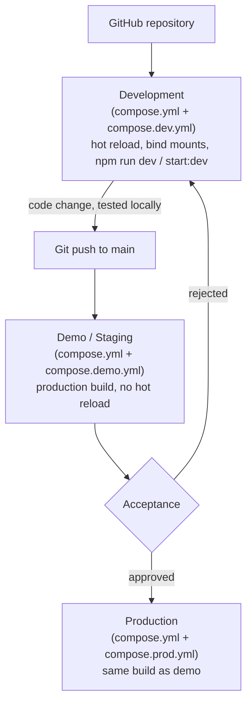

# Deployment Architecture

Leinaflow runs from a single base Compose file plus one environment-specific
overlay. Three environments — development, demo, production — share the same
`compose.yml` and the same two Dockerfiles; what changes between them is only
the overlay file and the per-host `.env` / `.env.production` content.

```
compose.yml            <- services, networks, volumes, healthchecks,
                           restart policies, security options (all envs)
  + compose.dev.yml     -> development: hot reload, bind mounts, published ports
  + compose.demo.yml    -> demo: production build, read-only containers
  + compose.prod.yml    -> production: identical to demo
```

## Where infrastructure ends and Leinaflow begins

```
Internet
    │
Reverse proxy (infrastructure — TLS, DNS, operator's choice)
    │
──────────────────────────────────────────────
Leinaflow (this repo)
──────────────────────────────────────────────
Frontend (Next.js)  :3000
Backend  (NestJS)   :4000
PostgreSQL
Redis
Storage
```

Leinaflow does not deploy, configure, or manage a reverse proxy. There used
to be an internal nginx container between the public entry point and
frontend/backend — it was removed as a deliberate architectural
simplification (duplicate proxy logic, an extra health check, an extra
point of failure). A reverse proxy — whichever one the operator chooses
(Nginx Proxy Manager, Traefik, Caddy, HAProxy, Cloudflare Tunnel, ...) — is
infrastructure that sits in front of this stack, not a service this repo
defines. What used to be the internal nginx's job now
lives either upstream (TLS, DNS, public routing — infrastructure's
responsibility) or inside the application itself:

- **Security headers** (`X-Frame-Options`, `X-Content-Type-Options`,
  `Referrer-Policy`, `Permissions-Policy`, ...) are set by the frontend
  itself, in [frontend/next.config.mjs](../../frontend/next.config.mjs)'s
  `headers()` — not by an infrastructure component in front of it.
- **Upload size limits** are enforced by the backend's own Multer
  configuration (`MEDIA_MAX_FILE_SIZE_MB`, see
  [backend/src/media/media.module.ts](../../backend/src/media/media.module.ts)),
  not by a proxy's `client_max_body_size`.
- **TLS, DNS, and public routing** are the reverse proxy's job — outside
  this repo entirely.

Overlays only ever touch `build.target`, `command`/image defaults,
`volumes`, `environment`, and `ports`/`expose` — everything else (service
names, networks, healthchecks, restart policy, ulimits) lives once in
`compose.yml` so it can't drift between environments.

## Promotion flow



Demo and production intentionally run the **same Docker images, the same
build target, the same runtime flags** — see [compose.demo.yml](../../compose.demo.yml)
and [compose.prod.yml](../../compose.prod.yml), which are near-identical by
design (verified with `docker compose config`, see below). The only thing a
promotion from demo to production changes is which `.env.production` a host
loads — never the compose logic. That's what makes a demo performance test
representative of production.

## Verifying demo/production parity

Because the two overlay files are meant to stay identical, any change to one
must be mirrored in the other. To confirm they currently produce the same
merged configuration:

```bash
diff \
  <(docker compose -f compose.yml -f compose.demo.yml config) \
  <(docker compose -f compose.yml -f compose.prod.yml config)
```

An empty diff means demo and production are running identical software —
the property this architecture exists to guarantee.

## Docker image build stages

Both Dockerfiles are multi-stage so development tooling and
`devDependencies` never end up in a production image.

**`docker/backend.Dockerfile`** (NestJS):

```
base        — installs all deps (npm ci), OS packages (openssl, ffmpeg)
├── development — full deps + source, `nest start --watch`
└── builder     — full deps + source, `nest build` -> dist/
    └── production — reinstalls prod-only deps (npm ci --omit=dev),
                      copies dist/ from builder, no source, no dev deps
```

**`docker/frontend.Dockerfile`** (Next.js):

```
deps        — installs all deps (npm ci)
├── development — full deps + source, `next dev`
├── builder     — full deps + source, `next build` -> .next/
├── prod-deps   — independent install, prod-only deps (npm ci --omit=dev)
└── production  — prod-deps node_modules + builder's .next/public/package.json,
                   no source, no devDependencies, no build toolchain
```

Before this change, the frontend's production stage reused the same
`node_modules` as development — meaning devDependencies (TypeScript,
Tailwind, ESLint, …) shipped in the production image. `prod-deps` is a
separate, independent install specifically so that's no longer the case.

## Two build-config fixes this restructure required

Stripping devDependencies out of the production images (above) surfaced two
pre-existing build-config issues that a full `node_modules` had been quietly
papering over — both required to actually run `docker compose -f compose.yml
-f compose.demo.yml up -d --build` end to end, not just to build the image:

- **`backend/tsconfig.build.json` now excludes `prisma/`.** `prisma/seed.ts`
  lives outside `src/`, and without restricting the build's file set, `tsc`
  inferred the project's common root as the repo root instead of `src/`,
  emitting `dist/src/main.js` + `dist/prisma/seed.js` instead of the
  top-level `dist/main.js` that `node dist/main` (and `npm run start:prod`)
  expect. `prisma/seed.ts` itself still runs fine via `ts-node
  prisma/seed.ts` (the `prisma:seed` script) — it was never meant to be part
  of the compiled build output.
- **`frontend/next.config.ts` is now `frontend/next.config.mjs`.** Next.js
  needs the `typescript` package installed to load a `.ts` config file at
  runtime; with devDependencies correctly excluded from the production
  image, `next start` tried to auto-install TypeScript on first request and
  failed (`read_only: true` blocks writing to `node_modules`). A plain `.mjs`
  config loads natively — no compiler needed — and needs no application
  behavior change (same `rewrites()` proxy logic).

## Networking

All services share one bridge network, `creator-network` (Docker resource
name: `${PROJECT_NAME:-creator}-network`); containers reach each other by
service name (`http://backend:4000`, `postgres:5432`, ...).

- **Development**: frontend/backend/postgres/redis ports are published to
  the host (`FRONTEND_PORT`/`BACKEND_PORT`/`POSTGRES_PORT`/`REDIS_PORT` from
  `.env`) for local tooling (psql, Redis CLI, browser). `mailhog` also
  publishes its web UI on `8025`.
- **Demo/production**: frontend and backend only `expose` their ports
  internally — nothing is published to the host by default. Postgres/Redis
  are never reachable from outside Docker.

  Leinaflow deliberately doesn't decide how a reverse proxy reaches
  frontend/backend in demo/production — that's an infrastructure topology
  choice, not something the app should hardcode:
  - **Preferred**: the reverse proxy joins `creator-network` directly and
    reaches the containers by service name
    (`frontend:3000`, `backend:4000`) — no host port involved at all.
  - **When required**: a host-specific compose override (outside this
    repo's tracked files) publishes whatever ports that deployment needs.

  Either way, `deployment/healthcheck.sh` and `deployment/deploy.sh`'s smoke
  tests check frontend/backend from inside their own containers (see
  `deployment/lib/common.sh#http_check_in_container`), so they pass
  regardless of which topology a given host uses.

## Security posture

| Setting | Development | Demo / Production |
|---|---|---|
| Filesystem | writable (bind mounts) | `read_only: true` + `tmpfs` for `/tmp` |
| User | container default (root-equivalent build tools) | `1000:1000` (non-root) |
| `no-new-privileges` | yes | yes |
| Published ports | app ports directly | none by default — see [Networking](#networking) |
| Build target | `development` | `production` |
| Security headers | set by Next.js (`frontend/next.config.mjs`) | set by Next.js (`frontend/next.config.mjs`) |
| Upload size limit | Multer (`MEDIA_MAX_FILE_SIZE_MB`) | Multer (`MEDIA_MAX_FILE_SIZE_MB`) |

`tmpfs` mounts for the non-root (`1000:1000`) demo/production containers
(backend's `/tmp` + `/app/node_modules/.cache`, frontend's `/tmp`) are
declared via the long-form `volumes: - type: tmpfs` syntax with an explicit
`mode: 0o1777` — Docker's tmpfs default is `root:root 0755`, which a
non-root process can't write into.

On a host that previously ran the `media_storage` volume as a root-owned
dev container before switching that same host to demo/production, the
volume's existing top-level ownership stays root and the new non-root
container can't write to it either — a one-time
`docker run --rm -v creator-media-storage:/data alpine chown -R 1000:1000
/data` fixes it. A fresh host never hits this: the backend Dockerfile's
production stage already `chown`s the image's own `/data/media` path, which
Docker copies onto a brand-new named volume the first time it's mounted.

## Healthchecks

`compose.yml` defines a healthcheck for every service that can meaningfully
report readiness:

| Service | Check |
|---|---|
| postgres | `pg_isready` |
| redis | `redis-cli ping` |
| backend | `GET /v1/health` responds at all (liveness — see note below) |
| frontend | `GET /` returns < 400 (Node's built-in `http` — the image ships no curl/wget) |

`frontend` depends on `backend` with `condition: service_healthy` — so
`docker compose up -d` only reports frontend "started" once backend is
actually answering requests, not just once its process has launched.

**Backend healthcheck is liveness-only, not the full `/v1/health` body.**
`/v1/health` aggregates several sub-checks (database, redis, storage,
notification provider, ...) and returns HTTP 503 if *any* of them is down —
including optional ones like the SMTP relay. If the container healthcheck
required a 2xx from that endpoint, an SMTP outage would mark backend
unhealthy, which would then block frontend from ever starting (its
`service_healthy` dependency would never clear). The Docker-level
check instead only confirms the HTTP server responds at all — "is the
process alive," not "are all upstream dependencies perfect." The detailed
`/v1/health` body remains available for monitoring/alerting to inspect
deeper status; that's a separate concern from container orchestration.

## Multi-product naming

This deployment structure (`compose.yml` + one overlay, the two multi-stage
Dockerfiles, `deployment/*.sh`) is intended to be the standard other Cloudivo
products (Ticket Engine, Identity, Asset Management, Monitoring, AI
Platform, ...) adopt too — not just Leinaflow's own pattern. The one thing
that does **not** generalize by default is naming: every Docker resource
(containers, the network, named volumes) was originally hardcoded to a
`creator-` prefix. Two different products both using this exact template on
the same Docker host would then collide — same container names, same
network name, same volume names — which risks one product's containers
silently attaching to (or overwriting) another's.

The fix is `PROJECT_NAME` (set in `.env`, already present but previously
unused): every resource name in `compose.yml`/`compose.dev.yml`/
`compose.demo.yml`/`compose.prod.yml` reads `${PROJECT_NAME:-creator}`
instead of a literal `creator-...` string, and `deployment/lib/common.sh`
exposes the same value as `RESOURCE_PREFIX` for the shell scripts
(`backup.sh`, `restore.sh`, `uninstall.sh`, `install.sh`,
`bootstrap/09-summary.sh`, and `check_ports`'s "already installed" check).
Leinaflow's own `.env` keeps `PROJECT_NAME=creator` specifically so this
change doesn't rename anything on hosts that already have Leinaflow
running — it's a pure templating hook. A new product adopting this
standard sets its own value (e.g. `PROJECT_NAME=ticketengine`) and gets
fully isolated container/network/volume names for free, with zero changes
to the compose files or scripts themselves.

Note this only covers **naming**, not port collisions: `FRONTEND_PORT`/
`BACKEND_PORT`/`POSTGRES_PORT`/`REDIS_PORT` still default to
`3000`/`4000`/`5432`/`6379` in development, so two products sharing one
development host still need distinct values set in each product's own
`.env`. Demo/production don't have this problem the same way — nothing is
published to the host by default there (see [Networking](#networking)), so
co-hosting multiple products just means the shared reverse proxy joins each
product's own `creator-network`-equivalent and routes to each by service
name; that reverse proxy's own configuration is infrastructure, out of
scope for this repo.

## Notes for other Cloudivo products adopting this standard

Beyond naming, a few things are worth deciding deliberately rather than
copying by default when a new product (Identity, Ticket Engine, Asset
Management, Monitoring, AI Platform, ...) adopts this pattern:

- **Service list is Leinaflow-specific, the layering pattern isn't.** The
  actual reusable asset is "one base `compose.yml` + a dev/demo/prod
  overlay, each overlay only touching `build.target`/`volumes`/
  `environment`/`ports`/`command`." A product with a different shape (a
  background-worker-heavy service like Monitoring, or a GPU-dependent one
  like the AI Platform) should design its own service list inside that same
  layering convention rather than trying to reuse Leinaflow's frontend +
  backend + Postgres + Redis services as-is.
- **Cross-product calls stay outside Docker's internal network.** Identity
  is the clearest case — other products will call it over HTTP using a
  configured URL (Leinaflow's backend already has an empty `IDENTITY_URL=`
  placeholder for this), not by joining Identity's Docker network. Each
  product keeps its own isolated `creator-network`-equivalent; nothing here
  assumes or requires a shared Docker network across products.
- **No propagation mechanism yet.** If a future fix to this pattern (a
  healthcheck improvement, a security setting) should apply everywhere,
  there's currently no shared mechanism for that beyond manually copying
  the change into each product's checkout. Worth a deliberate decision later
  (a shared base image, a documented checklist, or a small internal
  generator) once a second product actually adopts this — not solved
  speculatively here.
- **Backups are per-product, per-host, local-disk today.** `backup.sh`
  writes to `<project root>/backups/`. Fine for one product; if several
  products' backups need centralized retention/offsite storage later,
  that's an addition to (not a redesign of) this scheme — `backup.sh`
  already prints the backup path as its last line specifically so an
  external process can pick it up (e.g. upload it to shared storage).

## Related docs

- [Development.md](Development.md) — running and working with the dev stack
- [Demo.md](Demo.md) — deploying and validating demo/staging
- [Production.md](Production.md) — deploying production
- [Rollback.md](Rollback.md) — recovering from a bad deploy
- [../Deployment.md](../Deployment.md) — the `deployment/*.sh` automation scripts (install/update/backup/restore/healthcheck) that wrap these compose commands for real hosts
